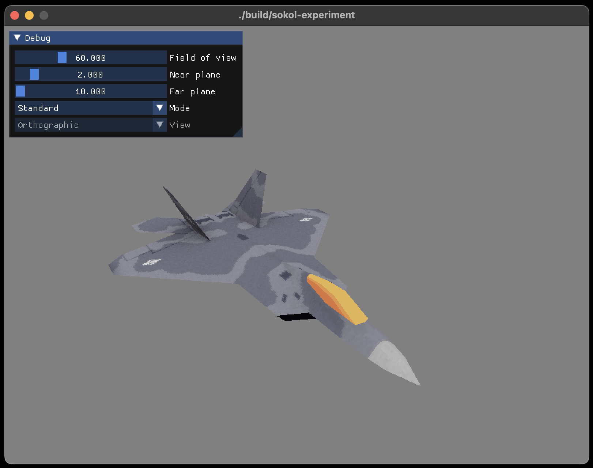
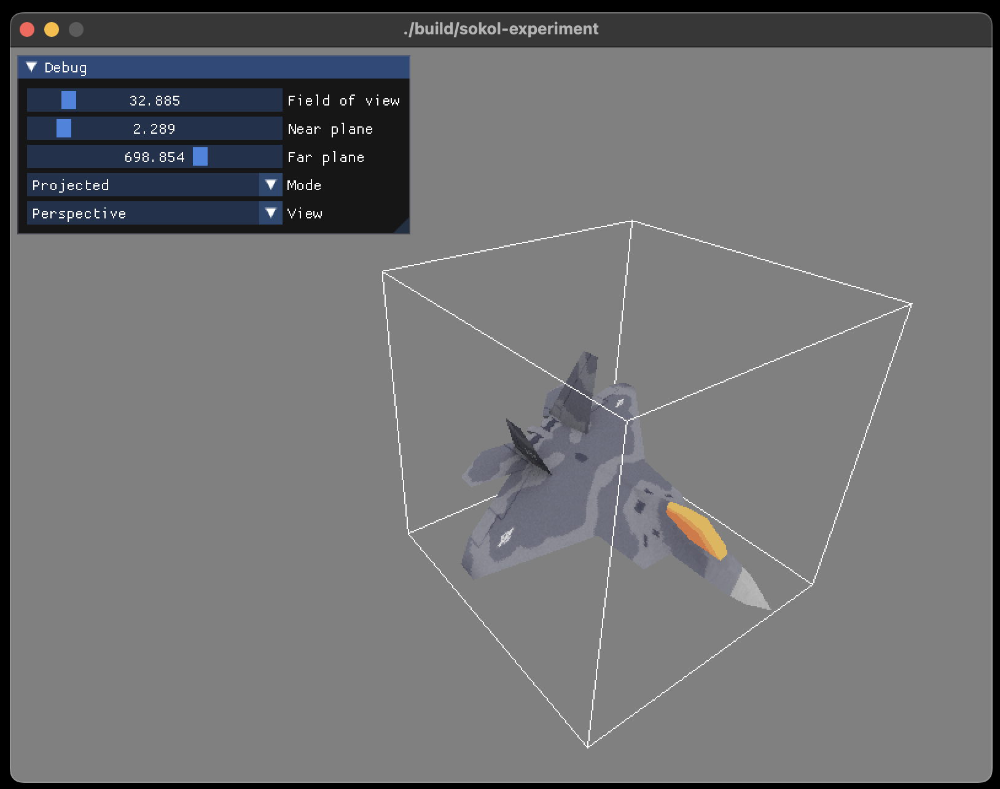

# sokol-experiment

An experimental project to learn more about [sokol](https://github.com/floooh/sokol) by [Andre Weissflog (floooh)](https://github.com/floooh).

Initial sample using SDL2 with OpenGL (based on [sokol_gfx sample](https://github.com/floooh/sokol#sokol_gfxh)).

## Update

This project has grown into a mini prototype to help visualize perspective projection. Still very much WIP and hacky/experimental but already useful to visualize the effect.

> Note: The fantastic F22 model is from [3D Graphics Programming from Scratch](https://pikuma.com/courses/learn-3d-computer-graphics-programming), a course on [Pikuma](https://pikuma.com/). Thanks to [Gustavo Pezzi](https://github.com/gustavopezzi) for kindly letting me use it in this project.





### Controls

- Right mouse button + mouse move - Free look
- WASD - Move forward, back, left and right
- EQ - Move up and down
- P - Toggle 'projected' mode (visualize projection). Default is 'standard'.
- V - Toggle projection type (perspective/orthographic) while in 'projected' mode. Default is orthographic.

## Building

### Prerequisites

You'll need the normal stuff like CMake, a compiler (e.g. Visual Studio/MSVC, GCC, Clang etc...) to really get started, below are the additional things you might bump into.

### Python

When trying to configure the repo initially, you may hit this error:

```bash
CMake Error at C:/Program Files/CMake/share/cmake-3.25/Modules/FindPackageHandleStandardArgs.cmake:230 (message):
  Could NOT find PythonInterp (missing: PYTHON_EXECUTABLE)
Call Stack (most recent call first):
  C:/Program Files/CMake/share/cmake-3.25/Modules/FindPackageHandleStandardArgs.cmake:600 (_FPHSA_FAILURE_MESSAGE)
  C:/Program Files/CMake/share/cmake-3.25/Modules/FindPythonInterp.cmake:169 (FIND_PACKAGE_HANDLE_STANDARD_ARGS)
  build/_deps/glad-src/cmake/CMakeLists.txt:44 (find_package)
```

This is most likely because Python can't be found on your system. You'll need to go ahead and [download]((https://www.python.org/downloads/)) it first.

If you configure again, you should then hopefully see something that looks like this...

```bash
Found PythonInterp: C:/Users/hultonha/AppData/Local/Programs/Python/Python311/python.exe (found version "3.11")
-- Glad Library 'glad_gl_core_33'
```

Configuring should now be complete, but when attempting to build it's possible you'll hit an error with a missing dependency (a Python one which is required by Glad), `Jinja2`.

To install this find wherever pip (Python's package manager) is on your system (it will have been installed with your previous Python installation, most likely in your AppData folder on Windows).

Then run `pip install jinja2` to have Python install that dependency for you (you might want to add pip to your Path environment variable too for easy access).

Once that's installed, building the project should work as expected.

## Setup and configuration

### Windows

To ensure the MSVC compiler (and programs such as Ninja) are found correctly, it's best to run the Visual Studio Developer Command Prompt (you can find this in All Programs usually). If you'd rather use a different terminal such as [cmder](https://cmder.app/) or [Microsoft Terminal](https://apps.microsoft.com/store/detail/windows-terminal/9N0DX20HK701?hl=en-gb&gl=gb) then ensure you run `VsDevCmd.bat` which sets the Visual Studio related environment variables (essentially what happens when launching the Visual Studio Developer Command Prompt). It is located here `Program Files\Microsoft Visual Studio\Version\Common7\Tools` or `Program Files (x86)\Microsoft Visual Studio\Version\Common7\Tools`.

- `cmake -B build` (if you've done the above steps also specifying `-G Ninja` isn't a bad idea)
- `cmake --build build`

then...

- `build\Debug\sokol-experiment.exe` (if using Visual Studio)
- `build\sokol-experiment.exe` (if using Ninja)

### macOS

- `cmake -B build -G Ninja` (`-G Ninja` is optional but will make things much faster).
- `cmake --build build`

then...

`./build/sokol-experiment`

### Linux

Untested, but should be roughly the same as above.
